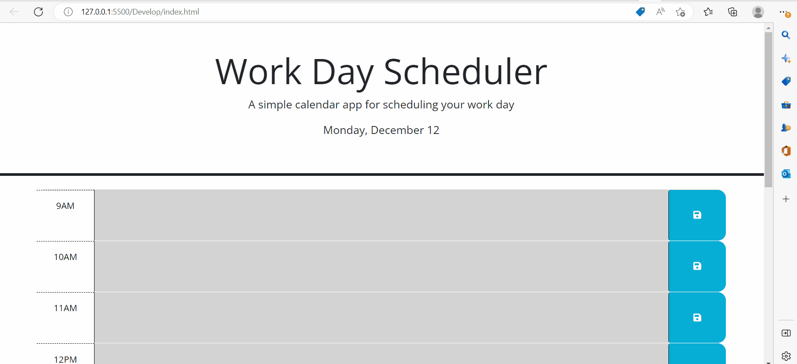

# Module-5-Challenge

## Third-Party APIs Challenge: Work Day Scheduler

## Description

This application is a work day scheduler/simple calender application/ that allows user to save events for each hour of the day. Based on the provided starter code Day.js library , jquery and different Javascript solutions are utilized to make this page functional. 

URL: 

-----
&copy; 2022 